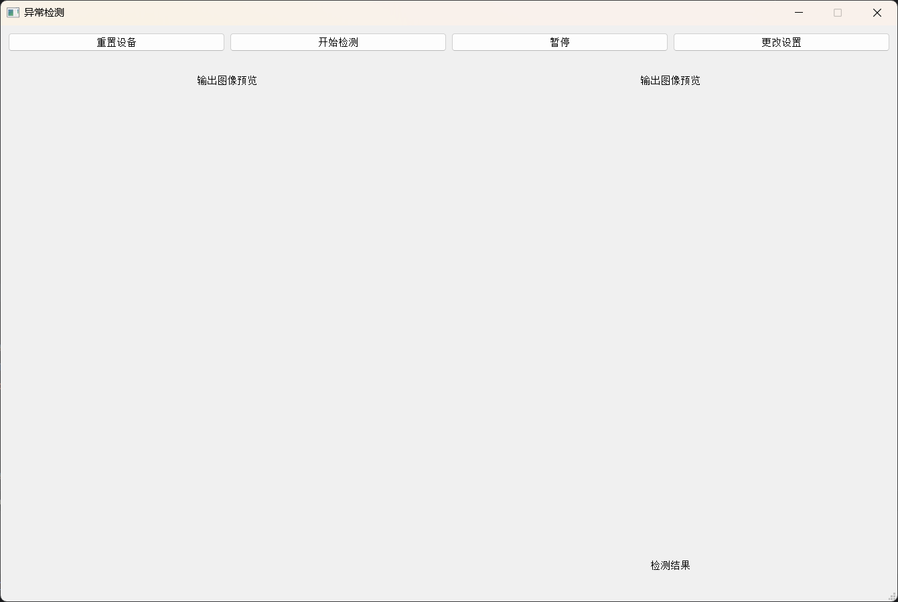
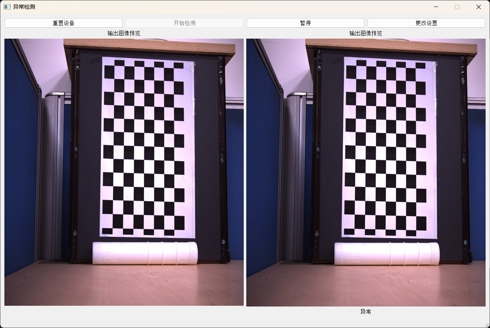
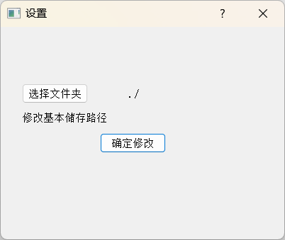

# 异常检测客户端
- 使用pyqt实现的客户端，各模块接口在module文件中，实现后还需联合微调代码
## 基本界面如下

### 初始界面

### 点击开始检测按钮

### 更改设置 


## 继续开发介绍

#### 重置设备按钮
- 重新获取畸变数据等，也会初始化模型和各线程
#### 数据输入
- 数据输入需要自令起线程，以实现一边检测一边输入新的数据
#### 储存数据格式
-  主要以文件夹明明来区分，储存目录下以日期为索引，如20231002代表2023年10月02日的数据，abnormal1 代表第一个不正常的数据
#### 区分同一样品
-  当n秒内没有检测到样品时，会标记下一个检测到的目标是新的样品，就会储存到新的文件夹中   <font color=Red>n秒数据需要根据实际情况以及算法调整区分同一样品策略</font>
#### 线程堵塞策略
-  使用event来堵塞线程

#### 使用
核心库就仨
```agsl
pip install PyQt5

pip install PyQt5-tools

pip install opencv-python
```